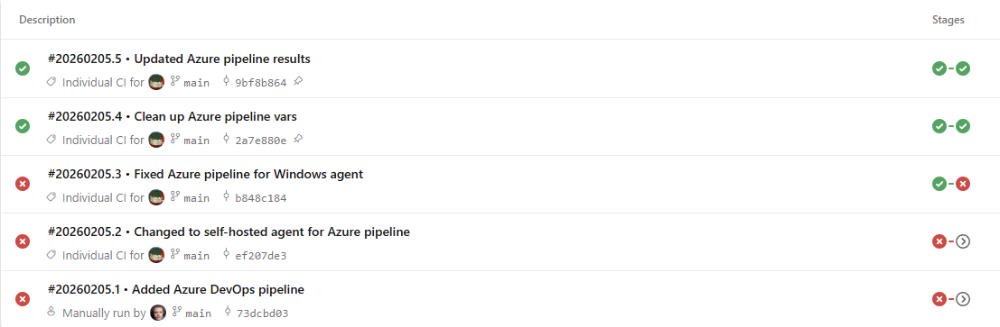
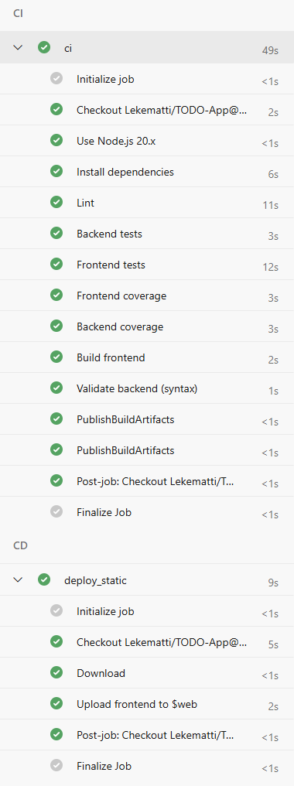

# Mini TODO App

Tämä on osa opinnäytetyötäni jossa teen kolmelle eri alustalle CI/CD putken. Kaikissa alustoissa tulee olemaan sama projekti pohjana. Laitan tänne myös muiden alustojen linkit kun ne ovat tehty.

- Github: (<https://github.com/Lekematti/TODO-App>)
- Gitlab: (<https://gitlab.com/Lekematti/todo-app>)
- Azure: Ei julkista sivua.

Full-stack mini TODO -sovellus, jossa on Node.js + Express + SQLite (sql.js) -backend ja React + Vite -frontend.

Sovellus näyttää muistilappu-tyylisen TODO-listan, jossa voit lisätä, muokata, poistaa ja merkitä tehtäviä valmiiksi. Kaikki muutokset tallennetaan SQLite-tietokantaan backendin kautta.


## Rakenne

- Root npm-projekti: [package.json](package.json)
  - `dev:backend` käynnistää backendin
  - `dev:frontend` käynnistää frontendin
  - `dev` käynnistää molemmat yhtä aikaa
- Backend-koodi: [backend/src/server.js](backend/src/server.js), [backend/src/db.js](backend/src/db.js)
  - Tietokantatiedosto: [backend/todos.sqlite](backend/todos.sqlite) (luodaan automaattisesti)
- Frontend-koodi: [frontend/src/App.jsx](frontend/src/App.jsx), [frontend/src/main.jsx](frontend/src/main.jsx), [frontend/src/styles.css](frontend/src/styles.css), [frontend/index.html](frontend/index.html), [frontend/vite.config.mjs](frontend/vite.config.mjs)

## Asennus

1. Asenna riippuvuudet juuresta:
   - `npm install`

## Kehityskäynnistys

- Käynnistä backend ja frontend yhdellä komennolla juuresta:
  - `npm run dev`

Tämä ajaa:

- Backend: [http://localhost:4000](http://localhost:4000)
- Frontend: [http://localhost:5173](http://localhost:5173)

Halutessasi voit myös ajaa erikseen:

- Vain backend: `npm run dev:backend`
- Vain frontend: `npm run dev:frontend`

## Toiminnot

- Näytä kaikki TODOt (GET `/api/todos`)
- Lisää uusi TODO (POST `/api/todos`)
- Muokkaa TODO:a (PUT `/api/todos/:id`)
- Poista TODO (DELETE `/api/todos/:id`)
- Klikkaus muistilapun tekstin päällä togglaa valmiiksi/ei-valmiiksi (PUT `done`-kenttään)

## Deploy (Netlify + Render)

### Frontend (Netlify)

- Build-komento: `npm run build:frontend`
- Publish-kansio: `frontend/dist`
- Environment variable:
  - `VITE_API_BASE_URL=https://todo-app-backend-vc2f.onrender.com/api`

### Backend (Render)

- Web Service (Node)
- Root Directory: `backend`
- Build Command: `npm install`
- Start Command: `node src/server.js`
- Free tier sleepaa, joten ensimmäinen pyyntö voi olla hidas.

## CI/CD

### GitHub Actions

GitHub Actions -workflow löytyy tiedostosta [.github/workflows/main.yml](.github/workflows/main.yml).

`ci`-jobin putki tekee tällä hetkellä:

1) Install (Node 20 + `npm ci`)
2) Lint (`npm run lint`)
3) Backend tests (`npm run test:backend`)
4) Frontend tests (`npm run test:frontend`)
5) Frontend coverage (`npm run test:frontend:coverage`)
6) Backend coverage (`npm run test:backend:coverage`)
7) Build frontend (`npm run build:frontend`, käyttää `VITE_API_BASE_URL` ‑secretiä)
8) Validate backend (syntax, `node --check backend/src/server.js`)
9) Package (upload-artifact: frontend-dist + backend-code)

Lisäksi workflowissa on erillinen `cd`-job, joka on tällä hetkellä estetty ehdolla `if: ${{ false }}`. Se sisältää kommentoituna Netlify- ja Render-deploy stepit ja toimii pohjana CD-osuudelle, mutta ei nyt aja deployta (krediittien säästämiseksi).

Secrets GitHubissa:

- `VITE_API_BASE_URL` (frontend buildissa käytettävä API-pohja-URL)
- `NETLIFY_AUTH_TOKEN` (käytössä vain, jos Netlify-deploy otetaan uudelleen käyttöön)
- `NETLIFY_SITE_ID` (käytössä vain, jos Netlify-deploy otetaan uudelleen käyttöön)
- `RENDER_DEPLOY_HOOK` (käytössä vain, jos Render-deploy otetaan uudelleen käyttöön)

### GitLab CI

GitLab CI/CD -putki on määritelty tiedostossa [.gitlab-ci.yml](.gitlab-ci.yml) GitLab-repossa.

Putki koostuu kahdesta stagesta:

1) `ci` – varsinainen CI (install, lint, testit, coverage, build)
2) `cd` – manuaalinen CD-job, joka voi tehdä Netlify- ja Render-deployt (ajetaan vain, jos käyttäjä käynnistää sen GitLabin UI:sta)

`ci`-job (Node 22 -image):

1) Install (`npm ci || npm install`)
2) Lint (`npm run lint`)
3) Backend tests (`npm run test:backend`)
4) Frontend tests (`npm run test:frontend`)
5) Frontend coverage (`npm run test:frontend:coverage`)
6) Backend coverage (`npm run test:backend:coverage`)
7) Build frontend (`npm run build:frontend`)
8) Validate backend (syntax, `node --check backend/src/server.js`)

Artefaktit GitLabissa:

- Frontend build: `frontend/dist/`
- Backend-koodi: `backend/`
- Backend coverage: `coverage/`
- Frontend coverage: `frontend/coverage/`

`cd`-job (stage `cd`, `when: manual`):

- Ajetaan vain manuaalisesti GitLabin CI/CD → Pipelines -näkymästä (Play-nappi).
- Jos Netlify-muuttujat on asetettu, kutsuu Netlify API:a ja käynnistää frontend-deployn.
- Jos `RENDER_DEPLOY_HOOK` on asetettu, kutsuu Renderin deploy hookia ja käynnistää backend-deployn.
- Jos muuttujia ei ole asetettu, jobi ohittaa kyseisen deployn ja tulostaa lokiin tiedon puuttuvasta muuttujasta.

GitLab CI/CD -muuttujat:

- `NETLIFY_AUTH_TOKEN` (Netlify deploy API -token)
- `NETLIFY_SITE_ID` (Netlify-sivuston ID)
- `RENDER_DEPLOY_HOOK` (Renderin deploy hook -URL)

### Azure DevOps

Azure DevOps -pipeline löytyy tiedostosta [azure-pipelines.yaml](azure-pipelines.yaml).

Pipeline tekee:

1) Install (Node 20 + `npm ci`)
2) Lint (`npm run lint`)
3) Backend tests (`node --test backend/tests`)
4) Frontend tests (`npm run test:frontend`)
5) Frontend coverage (`npm run test:frontend:coverage`)
6) Backend coverage (`npx c8 node --test backend/tests`)
7) Build frontend (`npm run build:frontend`, käyttää `VITE_API_BASE_URL` -muuttujaa)
8) Validate backend (syntax, `node --check backend/src/server.js`)
9) Deploy frontend Azure Storage Static Websiteen (`$web`-container)

Julkaisu:

- Frontend (Azure Static Website): <https://todoapplk.z16.web.core.windows.net/>
- Backend (Render): <https://todo-app-backend-vc2f.onrender.com/api>

Kuvia ADO-pipelinestä:




## Linttaus

```bash
npm run lint
```

## Testikattavuus (Coverage)

**Backend:**

```bash
npm run test:backend:coverage
```

**Frontend:**

```bash
npm run test:frontend:coverage

Coverage-raportit:

- Backend: `coverage/`
- Frontend: `frontend/coverage/`
